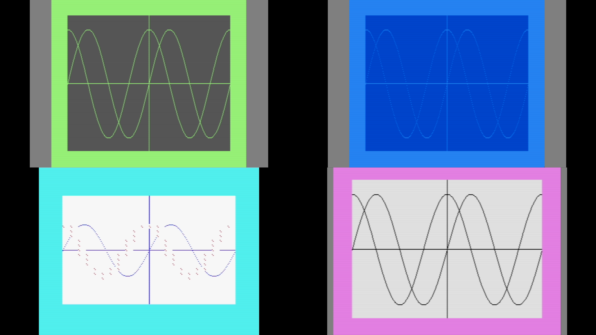
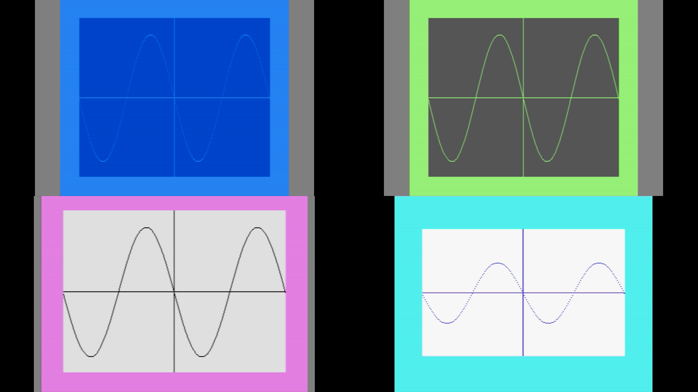

# vice-background-creator

Boots four [VICE](https://vice-emu.sourceforge.io/) emulators (`x128`, `x64sc`, `xvic`, `xplus4`), screenshots each, and stitches them into a 1920x1080 2x2 grid sized for a Google Meet background - saved both flipped horizontally (the "meet background", since Meet mirrors your camera) and unflipped.

Optionally autostarts a BASIC listing on every emulator first, so the grid shows something more interesting than the READY screen.

## Usage

```powershell
.\New-ViceMeetBackground.ps1
.\New-ViceMeetBackground.ps1 -ViceBaseFolder "D:\Apps\GTK3VICE-3.10-win64" -OutputFile "C:\Backgrounds\vice.png"
.\New-ViceMeetBackground.ps1 -BasicFile "sine.bas"
```

See `Get-Help .\New-ViceMeetBackground.ps1 -Full` for all parameters (VICE folder, output paths, capture timing).

Each emulator's screenshot is captured by `New-ViceScreenshot.ps1`, run as its own isolated process per emulator. It also works standalone for just one machine:

```powershell
.\New-ViceScreenshot.ps1 -Emulator xvic -BasicFile "sinecos.bas" -OutputFile "C:\tmp\xvic.png"
```

## Examples

Unflipped 2x2 grid, all four emulators at the default READY screen:



Flipped (mirrored) version used as the actual Meet background:



## basic-files/

BASIC listings the `-BasicFile` parameter can autostart, tokenized to a `.prg` via VICE's `petcat` at runtime. Organized by target:

- `common/` - shared across all emulators (e.g. `10print.bas`)
- `64/`, `128/`, `vic-20/`, `plus4/` - emulator-specific listings (each currently has a `sine.bas` and a `sinecos.bas`)

A file is looked up in `common/` first, then the emulator-specific folder.

## License

[MIT](LICENSE)
